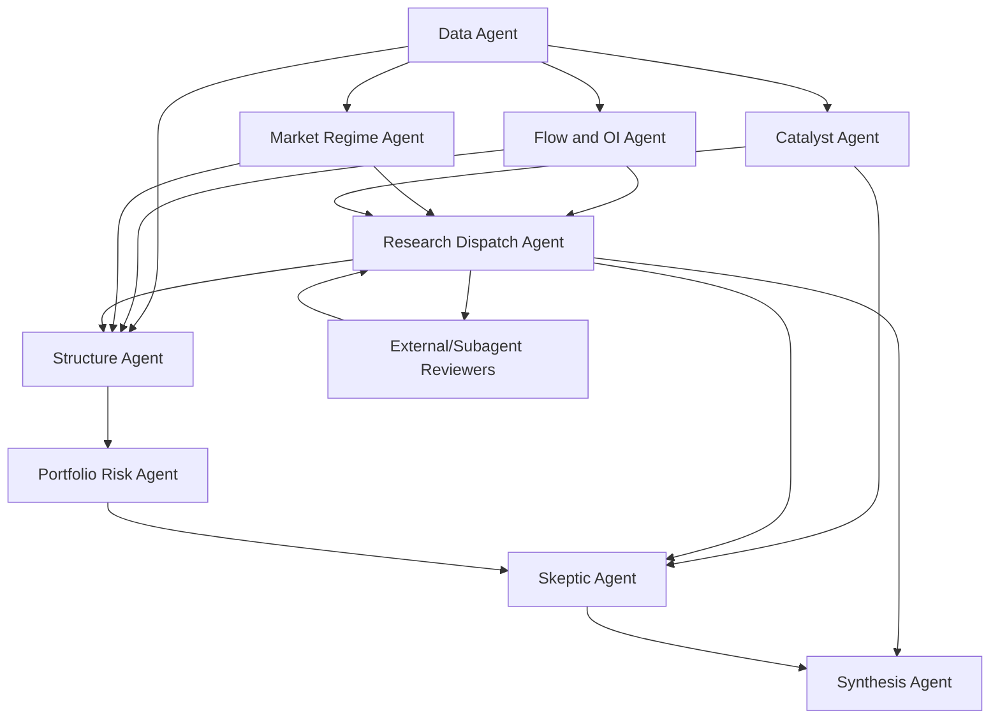

# Options Agent Design

**Date:** 2026-05-24
**Status:** Draft implementation contract
**Owner:** Anu + Codex

## 1. Purpose

Options Agent is a new, independent options-research and recommendation
pipeline. It should perform end-to-end discovery, validation, pricing,
portfolio-risk review, and final trade recommendation synthesis without relying
on Codex Daily V4 code or Codex Daily V4 output artifacts.

The agent can reuse general trade-desk infrastructure, such as Schwab auth,
quote helpers, Unusual Whales file readers, and generic pricing utilities, but
it must not import or read from Codex Daily V4 as an upstream pipeline.

## 2. Non-Dependency Contract

Options Agent is allowed to learn from the design lessons of prior pipelines.
It is not allowed to take a runtime dependency on Codex Daily V4.

Forbidden dependencies:

- No imports from `codexuw.daily_v4`.
- No shelling out to `python -m codexuw.daily_v4`.
- No default input reads from `out/codexdaily_v4_*`.
- No output names beginning with `codexdaily_v4`.
- No changes to `codexuw/daily_v4.py` as part of Options Agent work.
- No skill or CLI copy that aliases itself as Codex Daily.

Allowed shared dependencies:

- `uwos.paths` for root detection.
- `uwos.schwab_auth` for Schwab authentication and raw API access.
- `uwos.pricer` or other pricing/math helpers when they are not V4-specific.
- `uwos.spread_positions` for generic option-leg grouping.
- General Unusual Whales readers when they read raw dated source files directly.

## 3. Portfolio Risk Visibility Invariant

No otherwise good trade may be hidden, suppressed, or removed solely because of
portfolio risk.

Portfolio risk is still important. It should be surfaced clearly, but as an
annotation and sizing/review input:

- Good trade remains present in the final recommendation board.
- Portfolio concentration, correlation, existing exposure, buying-power strain,
  or sector crowding become explicit `portfolio_risk_*` fields.
- A risk note may change a recommendation from `ENTER` to
  `ENTER_WITH_PORTFOLIO_RISK`.
- Portfolio risk may suggest manual sizing caution.
- Portfolio risk may not create a portfolio-only hard reject for a trade that
  otherwise passes quality, liquidity, pricing, and catalyst checks.

Objective non-portfolio failures can still block a trade. Examples: broken
thesis, bad liquidity, missing live quote, impossible fill, event risk that
invalidates the structure, or payoff math that is not acceptable.

## 4. Agent Topology

Options Agent uses multiple specialized agents with deterministic handoffs.
The final recommendation is produced by a synthesis layer that consumes agent
outputs, not by any one research agent acting alone.



### Data Agent

Inputs:

- Dated Unusual Whales folder.
- Schwab positions, buying power, account balances.
- Live option chains and underlying quotes.

Outputs:

- `raw_universe.csv`
- `source_inventory.json`
- data quality notes

Responsibilities:

- Verify all required dated source files are available.
- Parse raw UW exports directly.
- Normalize tickers, expirations, strikes, premium, volume, OI, and trade side.
- Fail closed on missing source files, but do not silently produce an empty
  recommendation set without a no-trade audit.

### Flow and OI Agent

Inputs:

- Raw universe from the Data Agent.
- Multi-day flow/OI history when available.

Outputs:

- `candidate_generation.csv`
- per-ticker flow/OI review notes

Responsibilities:

- Identify directional flow, repeat sweeps, unusual premium, OI walls, support,
  resistance, and flow recency.
- Assign candidate direction and confidence.
- Preserve near misses with rejection reasons.

### Market Regime Agent

Inputs:

- SPY, QQQ, IWM, VIX or VIX proxy.
- Sector breadth and market internals when available.
- Macro calendar context.

Outputs:

- `agent_reviews/market_regime.md`
- regime fields in candidate rows

Responsibilities:

- Classify risk-on, risk-off, mixed, or event-driven conditions.
- Recommend structure preference, not ticker suppression.
- Identify when market regime should change sizing or entry patience.

### Catalyst Agent

Inputs:

- Earnings calendar.
- News, analyst actions, SEC filings, macro events.

Outputs:

- `catalyst_evidence.csv`
- `agent_reviews/catalyst.md`
- catalyst-risk fields in candidate rows

Responsibilities:

- Flag binary events and headline risk.
- Preserve auditable earnings and local browser/news evidence before
  summarizing it.
- Separate supportive catalysts from thesis-breaking catalysts.
- Require explicit event handling for earnings-overlapping trades.

### Research Dispatch Agent

Inputs:

- Candidate generation.
- Market regime.
- Catalyst reviews.
- Optional external/subagent review JSON.

Outputs:

- `research_tasks.json`
- `external_agent_reviews.csv`

Responsibilities:

- Package the top setups into stable review tasks for specialist agents.
- Normalize returned reviews into the expected schema.
- Treat `objective_blocker: true` as a hard blocker.
- Treat portfolio-risk-only reviews as annotations, even when the review
  verdict says `avoid`.

### Structure Agent

Inputs:

- Candidate direction.
- External/subagent reviews.
- Live Schwab chains.
- Price, Greeks, spreads, bid/ask width, volume, OI.

Outputs:

- `priced_candidates.csv`
- `structure_attempts.csv`

Responsibilities:

- Build concrete tickets, such as debit spreads, credit spreads, calendars,
  long calls/puts, iron condors, or wheel actions.
- Compute max profit, max loss, breakevens, remaining upside, target entry,
  target exit, and invalidation.
- Avoid recommending a structure without executable pricing.

### Portfolio Risk Agent

Inputs:

- Priced candidates.
- Schwab open positions and account exposure.
- Buying power and concentration map.

Outputs:

- `risk_audit.csv`
- portfolio risk annotations on each affected candidate

Responsibilities:

- Identify existing option exposure, large equity exposure, sector crowding,
  correlated beta, buying-power strain, and assignment risk.
- Annotate affected recommendations.
- Never remove an otherwise qualified trade from the visible board solely for
  portfolio risk.

### Sizing Agent

Inputs:

- Final recommendation rows.
- Portfolio context.
- Market-regime sizing stance.

Outputs:

- `sizing_audit.csv`
- sizing fields in final recommendation and trade-ticket rows

Responsibilities:

- Calculate suggested contract count, risk budget, maximum position loss,
  buying-power effect, and account-risk percentage.
- Flag one-lot or buying-power strain as sizing risk without hiding a trade.
- Never convert a good setup to `AVOID` solely because it exceeds normal sizing
  budget.

### Management Agent

Inputs:

- Final recommendation rows.
- Decision board.
- Sizing audit.

Outputs:

- `management_plan.csv`
- management fields in trade-ticket rows

Responsibilities:

- Write explicit entry conditions, target exits, invalidation rules, and review
  triggers for every visible recommendation.
- Keep `REVIEW`, `WAIT_FOR_PRICE`, and `AVOID` rows visible but clearly marked
  as not entry-ready.
- Add target-exit and invalidation context to entry-ready trade tickets.

### Skeptic Agent

Inputs:

- Candidate rows plus all prior agent reviews.
- External/subagent reviews.

Outputs:

- `no_trade_audit.csv`
- skeptical review notes

Responsibilities:

- Try to invalidate each trade.
- Separate objective hard blockers from caution notes.
- Ensure a good trade with portfolio risk remains visible with the risk called
  out.

### Synthesis Agent

Inputs:

- Agent reviews.
- External/subagent reviews.
- Priced candidates.
- Portfolio annotations.
- No-trade audit.

Outputs:

- `final_recommendations.csv`
- `options_agent_report_YYYY-MM-DD.md`
- `options_agent_manifest_YYYY-MM-DD.json`

Responsibilities:

- Produce the final recommendation board.
- Rank trades by trade quality first, then execution fit and portfolio fit.
- Make portfolio risk visible beside the trade rather than hiding the trade.
- Include the best rejected or waiting trades with clear reasons.

## 5. Recommendation Statuses

The final board uses explicit statuses:

- `ENTER`: Trade quality and execution are acceptable.
- `ENTER_WITH_PORTFOLIO_RISK`: Trade quality is acceptable, but portfolio risk
  must be called out before entry.
- `WAIT_FOR_PRICE`: Setup is valid, but the current quote does not meet the
  entry limit.
- `REVIEW`: Setup may be valid, but a human decision is required before entry.
- `AVOID`: Objective non-portfolio blocker exists.

Portfolio risk may change `ENTER` to `ENTER_WITH_PORTFOLIO_RISK`. It may not
change an otherwise good trade to `AVOID` by itself.

External/subagent review verdicts follow the same rule: only explicit objective
blockers can create `AVOID`; portfolio-risk-only warnings annotate the trade.

## 6. Artifact Contract

Default output directory:

```text
/Users/anuppamvi/uw_root/tradedesk/out/options_agent/YYYY-MM-DD
```

Required artifacts:

- `options_agent_manifest_YYYY-MM-DD.json`
- `options_agent_report_YYYY-MM-DD.md`
- `source_inventory.json`
- `raw_universe.csv`
- `market_regime.json`
- `candidate_generation.csv`
- `catalyst_evidence.csv`
- `catalyst_reviews.csv`
- `research_tasks.json`
- `agent_dispatch_plan.json`
- `agentic_reviews.json`
- `external_agent_reviews.csv`
- `agent_review_board.csv`
- `structure_attempts.csv`
- `priced_candidates.csv`
- `live_chain_validation.csv`
- `final_recommendations.csv`
- `decision_board.csv`
- `trade_tickets.csv`
- `no_trade_audit.csv`
- `risk_audit.csv`
- `sizing_audit.csv`
- `management_plan.csv`
- `options_agent_portfolio_context.json`
- `agent_orchestration.json`
- `agent_reviews/data.md`
- `agent_reviews/flow_oi.md`
- `agent_reviews/market_regime.md`
- `agent_reviews/catalyst.md`
- `agent_reviews/research_dispatch.md`
- `agent_reviews/structure.md`
- `agent_reviews/portfolio_risk.md`
- `agent_reviews/sizing.md`
- `agent_reviews/management.md`
- `agent_reviews/skeptic.md`
- `agent_reviews/synthesis.md`

The manifest must include:

- pipeline name and version
- as-of date
- source folder
- output folder
- agent roster
- artifact paths
- counts by status
- review-board summary by agent type, verdict, objective blockers, and
  portfolio-risk-only annotations
- visibility invariant acknowledgement
- warnings and data-quality issues

Review artifacts have separate meanings:

- `external_agent_reviews.csv` is the normalized optional outside input from
  `--agent-reviews-json`.
- `agent_review_board.csv` is the canonical merged board consumed by
  Structure, Skeptic, and Synthesis. It contains built-in deterministic reviews
  on every run, plus optional external/subagent reviews when supplied.

`agent_review_board.csv` schema:

- `candidate_id`
- `ticker`
- `agent`
- `agent_type` (`built_in`, `external`, or `subagent`)
- `review_stage`
- `verdict`
- `confidence`
- `objective_blocker`
- `blocker_type`
- `portfolio_risk_only`
- `note`
- `evidence`
- `source_artifact`
- `as_of`

The review board must be written under the Options Agent output namespace and
must never be sourced from Codex Daily V4 or `out/codexdaily_v4_*`.

## 7. Deterministic Row Fields

Every final recommendation should carry enough math to enter manually:

- `ticker`
- `bias`
- `structure`
- `full_ticket`
- `expiry`
- `dte`
- `entry_limit`
- `mid`
- `bid`
- `ask`
- `max_profit`
- `max_loss`
- `remaining_upside`
- `breakeven`
- `target_exit`
- `invalidation`
- `live_validation_status`
- `recommendation_rank`
- `synthesis_score`
- `synthesis_reason`
- `suggested_contracts`
- `risk_budget`
- `max_position_loss`
- `account_risk_pct`
- `buying_power_effect`
- `sizing_note`
- `management_action`
- `entry_condition`
- `review_triggers`
- `score`
- `recommendation_status`
- `status_reason`
- `portfolio_risk_flag`
- `portfolio_risk_note`
- `visible_in_final_board`

## 8. Validation Rules

Automated tests should enforce:

- Options Agent source does not import Codex Daily V4.
- Options Agent default output paths use the `options_agent` namespace.
- `agent_review_board.csv` is produced as an Options Agent-owned artifact and
  contains built-in review rows even when no external reviews are supplied.
- `catalyst_evidence.csv` preserves local earnings/news evidence and red-flag
  terms that drive Catalyst Agent cautions.
- Portfolio-risk annotations do not hide or hard-reject an otherwise qualified
  trade.
- Portfolio-only blockers are converted into risk notes when objective trade
  quality remains valid.
- Non-portfolio hard blockers still remain hard blockers.
- Entry-ready trade tickets require `ENTER` or `ENTER_WITH_PORTFOLIO_RISK`,
  a nonempty ticket, a positive entry limit, and live/snapshot validation
  status of `PASS`.
- Sizing annotations must not suppress an otherwise qualified trade; one-lot
  over-budget cases remain visible with sizing risk called out.
- Management plans must never present non-entry-ready rows as order tickets;
  review/wait/avoid rows receive explicit non-entry instructions.

## 9. Implemented V0 Slice

The first implementation slice is an independent EOD research path:

- Add an independent `uwos.options_agent` package.
- Add a CLI that writes the Options Agent manifest, report, raw universe,
  candidate generation, priced candidates, final recommendations, no-trade
  audit, risk audit, and agent review notes.
- Add pure functions for agent roster, output paths, and portfolio-risk
  annotation policy.
- Read dated UW source files directly through shared non-V4 data readers.
- Rank ticker-level candidates from stock screener, hot chains, chain-OI, and
  bot-EOD aggregates.
- Write deterministic market-regime, catalyst-evidence, and catalyst-review
  agent artifacts from
  UW index flow, UW earnings fields, and local browser-text news captures when
  present.
- Write `research_tasks.json` so external/subagent reviewers have a stable,
  schema-backed packet for each top setup.
- Write `agent_dispatch_plan.json` and support a `--dispatch-only` first pass
  so Codex can spawn subagents before final synthesis.
- Optionally ingest external/subagent reviews from JSON into
  `external_agent_reviews.csv`, where objective blockers can block a setup but
  portfolio-risk cautions remain annotations.
- Write `agent_review_board.csv` as the canonical merged review artifact,
  including built-in deterministic market-regime, catalyst, structure, skeptic,
  and portfolio-risk reviews plus optional external/subagent reviews.
- Attempt first-pass spread construction from dated UW hot-chain quotes.
- Write `structure_attempts.csv` so dated hot-chain and live Schwab chain
  construction outcomes are visible even when a setup is not entry-ready.
- Optionally validate and replace dated spread pricing from live Schwab chains
  or supplied Schwab chain snapshots.
- Optionally load portfolio context from JSON or live Schwab positions, writing
  Options Agent-owned portfolio artifacts.
- Compute contract sizing and write `sizing_audit.csv`; sizing risk remains an
  annotation and can require manual acknowledgement, but does not hide the row.
- Write `management_plan.csv` with entry conditions, target exits, invalidation
  rules, and review triggers for every visible recommendation.
- Keep dated quote gaps or live-chain construction gaps visible as `REVIEW` or
  `WAIT_FOR_PRICE` instead of suppressing the setup.
- Separate setup quality, execution readiness, and portfolio fit in
  `decision_board.csv`.
- Compute `synthesis_score` from flow score, agent-review support/cautions,
  live validation, and executable ticket math. Portfolio-risk-only annotations
  are kept visible but do not reduce setup-quality ranking.
- Emit `trade_tickets.csv` as visible trade plans whenever a desired
  credit/debit ticket exists, even when the row still needs fresh Schwab
  validation, price improvement, or manual review. `ready_to_enter` and
  `order_readiness` separate actual order readiness from the desired entry.
- Add tests for independence, artifact generation, and the portfolio visibility
  invariant.

The next implementation slices can then deepen live browser/news research,
Schwab validation breadth, and final ranking without revisiting the core policy
contract.

V0 limitation:

- When `--live-schwab` or `--chain-snapshot-dir` is not used, V0 recommendations
  use dated UW EOD quotes. Fresh Schwab chain validation is required before
  manual order entry.
